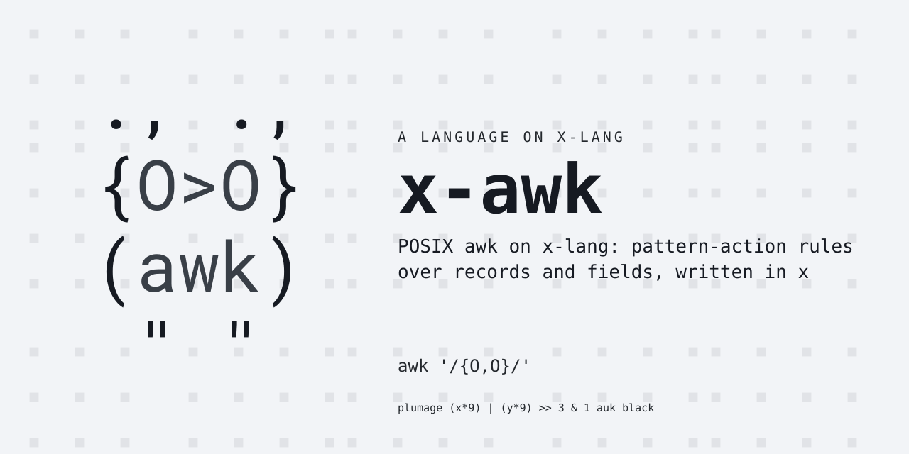
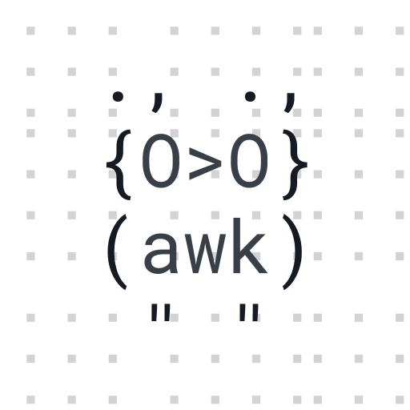

# x-awk

POSIX awk on x-lang: pattern-action rules over records and fields, written
in x.  Part of the self-hosting arc -- awk is the heaviest external tool in
x-lang's own build closure after the regex trio (see x-lang's
`docs/bootstrap-closure.md`), and this bundle is the step that absorbs it.

Status: pre-release.  The core runs: BEGIN/END and pattern-action rules,
fields and NR/NF/FS/OFS/ORS, exact-rational arithmetic with awk's %.6g
output formatting, ERE patterns and `~`/`!~` (on `lib/x/type/regex.x`,
compiled at parse time), strnum comparison semantics, `print`, control flow
(`if`/`else`, `while`, `do`, `for`, `next`, `exit`, `break`, `continue`),
`length`/`substr`/`index`/`int`; arrays: string-keyed with POSIX's paired
creation rules (referencing creates, `in` does not), `for (k in a)`,
`delete`, multi-subscripts through SUBSEP, and `split()` with string, FS,
or ERE separators; `printf`/`sprintf`: the full conversion set
(d i o x X u c s f e E g G %%) with flags, width, precision and `*`, every
digit from exact integer arithmetic, with OFMT and CONVFMT wired through
the same engine; field assignment with the POSIX rebuild rules ($i and NF
rebuild $0 through OFS, $0 re-splits per FS); and `sub`/`gsub` with &
expansion, writing through the same l-value door as assignment;
`toupper`/`tolower`; `match` with RSTART/RLENGTH; the math set (sin, cos,
atan2, exp, log, sqrt) on the platform's libm floats, converted back to
rationals at the boundary so floats never enter the value model; and
`rand`/`srand` on the platform's deterministic xorshift; `RS` including
paragraph mode; `getline` from the main input, files, and commands
(`"cmd" | getline`, one stream per command string); user functions;
output redirection (`print > f`, `>> f`, `| "cmd"` with SIGPIPE held
off), `close()`, `system()`; and the command line itself.  FEATURE
COMPLETE for the POSIX surface this bundle targets: what remains in
`tests/specs/04-divergences.spec.md` is recorded divergences, not
missing features.

Paired with x-lang v0.9.0 (`lang.xon` is the checkable row).

## Try it

    make install        # into the x on PATH

    x -l awk -- [-F ere] [-v a=v]... [-f prog.awk | 'program'] [file | a=v]...

    printf 'a b\nc d\n' | x -l awk '{print $2}'
    x -l awk -- -F: '{print $1}' /etc/passwd
    x -l awk 'BEGIN{exit 3}'; echo $?        # 3

The `--` lets awk's own -F/-v/-f through x.sh's option parsing; without
it, place options after the program text.  Files read in order (`-` is
stdin, stdin is the default), `var=value` operands assign in sequence,
FILENAME/FNR/ARGV/ARGC are live, and exit's status is the process's.
`x -l awk` with no operands is the x REPL with the awk core loaded --
`(awk-run PROGRAM-TEXT INPUT-TEXT)` is the pure core the suite drives.

Pre-release honesty: an interpreted awk on an interpreted tower is not
C awk -- after the first performance pass (byte-door scans, if-chain
dispatchers, no defs at depth: 2.8x on the record loop) it runs about
8ms/record plus a ~7s dialect boot.  Fine for scripts and suites;
size real data accordingly.  The next step is the platform's compile
lanes.

## Tests

    make test           # the suite, loud on any failure
    make check          # judged against tests/contract/known-failures.txt

Every end-to-end expectation in `tests/specs/03-run.spec.md` was taken from
a real awk run on the same program and input -- the oracle, not our own
expectations.

## Layout

    lang.xon          what this bundle IS (lang, dialect, pairing, entry)
    run.x             the entry: imports awk/base, wires the seam globals
    awk/prims.x       the platform layer, one file
    awk/lex.x         program text -> tokens (a string scanner; see base.x)
    awk/parse.x       tokens -> AST, grammar only
    awk/eval.x        the AST's meaning: values, records, the run loop
    awk/fmt.x         the printf engine; OFMT/CONVFMT route through it
    awk/cli.x         argv to a plan (pure), and awk-main (the exit)
    awk/printer.x     the lang's own write
    tests/            markdown specs + the platform's runner, vendored nowhere

